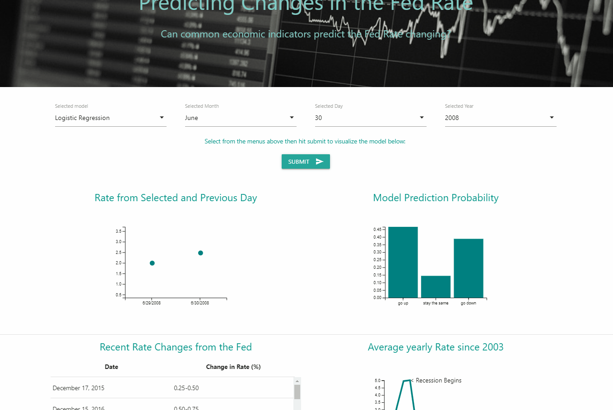

# Economic Indicators Influence on Interest Rates
#### *Disclaimer* 
This was a group project with contributions by Zeyu, Jesse and myself. Please visit the original repo at https://github.com/DataNoob0723/interest_rate_analysis for the original commits and links to my team members pages.

## The Working App 

## Overview:
This is a project to investigate how certain measures of the economy may or may not influence the fed rate changing.

### Scope: 
We will build a model to predict whether the chosen 48 metrics can predict whether the interst rate will go up, down, or 
go unchanged. We will utilize D3 to allow user interaction on our charts.
The user will be able to choose from a list of metrics which will change the visualization in real time.

### Key metrics we will investigate:

1. Growth 
    * Ex: GDP (Gross Domestic Product) - Used to measure the total value of everything produced in the Country. 
2. Prices and Inflation
    * Ex: CPI (Consumer Price Index) - An index of the variation in prices paid by typical consumers for goods. 
3. Money Supply 
    * Ex: M1  - A measure of the most liquid portions of money supply (checking accounts, physical coin, etc.) 
4. Interest Rates 
    * Ex: 3-Month Trearsury Bill(Secondary Market Rate) - Reflects the interest rate of a secondary 3 month bill. 
5. Employement 
    * Ex: Civilian Unemployment Rate - The number of civilians in the populus unemployed. 
6. Income and Expenditure 
    * Ex: Real Disposable Personal Income - Used to measure the amount of money households have for spending after taxes. 
7. Debt
    * Ex: Federal Debt - The total amount of public debt. 
8. Other Economic Indicators 
    * Ex: Oil Prices, Private Investment, Industrial Production, Trade Weighted U.S. Dollar Index. 

### Data Source:
Data will be extracted from quandl 
https://www.quandl.com/data/FRED-Federal-Reserve-Economic-Data/documentation

### Conclusion:

### Deploy:
We anticipate deploying our app to google cloud over time

